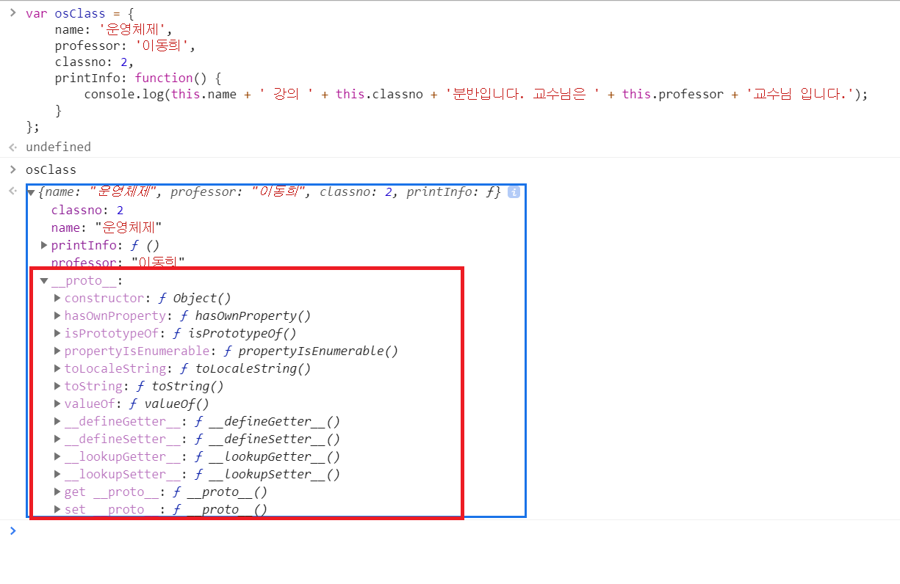

# \_\_proto__ (prototype)

(기억이 나실런지는 모르겠지만) <JS에게는 온 세상이 객체다_2. 실습> 강의의 04:22 에서
숨겨진 속성에 대해서도 언젠가는 정리해드린다고 말씀드렸었죠?

그 내용에 대해 정리해드립니다.

> 이 내용은 자바스크립트 언어의 원리를 설명하기 때문에, 조금 어려울 수 있습니다. 만약 자바스크립트/프로그래밍 자체가 처음이시라면 굳이 이해하지 않으셔도 괜찮습니다!

수업에서는 아래와 같은 객체를 선언한 뒤에,

```javascript
var osClass = {
    name: '운영체제',
    professor: '이동희',
    classno: 2,
    printInfo: function() {
        console.log(this.name + ' 강의 ' + this.classno + '분반입니다. 교수님은 ' + this.professor + '교수님 입니다.');
    }
};
```



console을 보면 아래와 같이 표시된다는 걸 알 수 있죠.
여기서 __proto__, prototype은 무엇인지에 대해 간략하게 설명드리자면,

자바스크립트는, 객체가 만들어지기 위해서는 자신을 만드는 데 사용된 원형인 프로토타입 객체를 이용하여 객체를 만듭니다. 

이때 만들어진 객체 안에 __proto__ (비표준) 속성에, '자신을 만들어낸 원형'을 의미하는 프로토타입 객체를 참조하는 링크가 있습니다. 

이 숨겨진 링크를 프로토타입이라고 정의합니다.

그리고 그 아래의 메서드들은 그 프로토타입 관련 정보들을 조회하고 연결하는 내장함수들이구요.

위 예제에서는 바로 직접 만들어준 객체라 크게 많은 정보가 __proto__에 담기진 않지만,

추후 Class로 상속을 하는 예제에서 console을 잘 보시면 __proto__에 proto에 본인 객체를 파생시킨 객체 정보가 담긴다는 걸 확인하실 수 있을 거에요.
